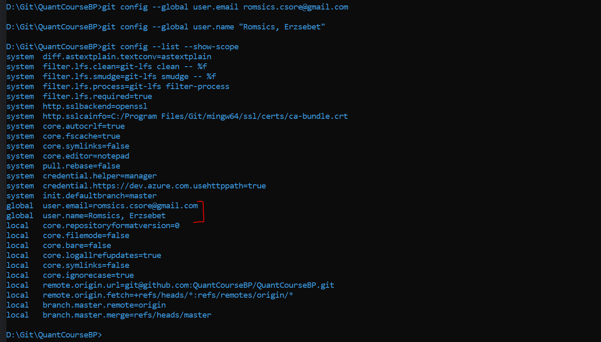

# How to setup the environment of QuantCourseBP?

*Editor*: Romsics, Erzsebet

*Table of content*:

* [Setup your own workspace](#setup-your-own-workspace)
* [How to setup Git?](#how-to-setup-git)
    * [How to clone with HTTPS](#how-to-clone-with-https) 
    * [How to setup SSH and clone with it](#how-to-setup-ssh-and-clone-with-it)
* [How to setup the Python environment?](#how-to-setup-the-python-environment)
    * [Create our virtual env](#create-our-virtual-env)
* [Trouble-shooting](#trouble-shooting)

---

<br>

## Setup your own workspace

First of all, we need three installation: Python as an engine, PyCharm as an IDE (integrated development environment) for Python, and Git for version tracking. After all this setup, you'll be able to checkout our code repository to start your journey!
1. **Python**: we use Python 3.9 
    * for Windows users: Python 3.9 is supported only above Windows 7, and a recommended version 3.9.13 can be downloaded from here: https://www.python.org/downloads/release/python-3913/ In case, you would look for a different subversion, check this page: https://www.python.org/downloads/windows/ (we recommend to download in .exe extension for first time users)
        * on the starting page of installer, it is recommended to check 'Add Python 3.9 to PATH' to be able to use *python* from command line
        * proceed with fast install with the 'Install Now' option (no customization is needed)
    * for Linux Users:
    * for MAC users:
2. **PyCharm**: (for all OS type) we recommend to download 2023.2 Community edition (which is free), all type of OS installers are available here: https://www.jetbrains.com/pycharm/download/other.html
    * we suggest to enable 'Create Associations .py' during installation, so .py files will open in PyCharm by default (especially, if you don't use other Python IDEs)
3. **Git**: we recommend to download Git 2.39 (with latest subversion, e.g. 2.39.2) here: https://git-scm.com/download/win
    * For Windows Users: we recommend to download the standalone version of Git, so you'll be able to setup some things during installation. For most of the things, please go with the default that the Git installer suggests (these will be configurable later). Few suggestions:
        * On page _Choosing the default editor used by Git_: select Notepad or Notepad++ (if you have it). We only recommend to use the default editor Vim, if you already know how to use it, otherwise it is pretty hard to learn. (it is quite an ancient editor, 30+ years old)
        * On page _Adjusting your PATH environment_: select 'Git from the command line and also from 3rd-party software', this will allow you to use Windows Command Prompt besides Git Bash (it is recommended for those who are more familiar with Windows, and would use Ctrl-C/Ctrl-V and Windows commands).

<br>

## How to setup Git?

Before you clone our remote repository, you need to setup the way of accessing it. There are two ways of setting up your
git connection, either using HTTPS or SSH. Although the first one is easier for starters, we highly recommend investing
a little more time setting up SSH (simply because it is safer from hijackers: if case your computer is stolen, only the
SSH key gets out, which you can delete any time in your GitHub account). Follow the relevant section below.

Either ways, `git clone` is used to get a local copy of our remote repository. Go to the opening page of our repository,
where you'll see the source code of our `master` branch. Cloning links are available on '<> Code' button <br>.


<br>

### How to clone with HTTPS

<details>
<summary> <b>Click here for details on HTTPS setup.</b> </summary>

<br>

1. Click on '<> Code' button, choose 'HTTPS' from cloning options, and copy the path from there: <br>
    
   
2. When you first connect to the remote e.g. via push or pull, Windows will connect to Github to login:
    

This way Windows Credential Manager will store your GitHub credentials to login each time you connect. Just remember to
delete/refresh it when you change your GitHub password.


</details>

<br>

### How to setup SSH and clone with it

<details>
<summary> <b>Click here for details on SSH setup.</b> </summary>

<br>

To use **SSH** (Secure Shell) for accessing our remote repo, you need to generate an SSH key pair by running the
following command in command line:

```
    ssh-keygen -t ed25519 -C <name-of-workstation>
```


<details>
<summary> <b>Click for more details: What is SSH, and why do we need it?</b> </summary>
<br>

The SSH protocol connects to the network in a secured way (i.e. encrypts the communication between endpoints), which
allows us to use Git through the command line and GUIs more easily. With SSH setup, we don't need to login all the time
connecting to the remote repository, the SSH public key-based authentication does it for us. But this key should be 
managed as a password, it should not be shared with anyone.

The following command line will generate a public and a private key: the former will be placed in the remote repository 
and the later remains on your PC. If no other location is provided, it will create an `.ssh` folder under your user 
profile (on Windows: `%USERPROFILE%\.ssh`, on Linux: `~/.ssh`). For extra encryption to secure your private key on the 
computer, you can provide a passphrase to the keygen. But this can be annoying during the development, since this 
passphrase will be requested every time you try to access the remote repo. To avoid this, you can skip the passphrase 
creation by hitting `ENTER` without any input (twice because of the confirmation).
If the `.ssh` folder is placed under your user or any safe location where no guests or other user on the PC can access 
it, you are good to go, it is unreachable. with the `-C` option, you can name your ssh keypair (it is recommended to 
use only the English alphabet).

</details>

To add the new key to your Github account, do the following:
1. Go to Settings > SSH and GPG keys (in Access section) <br>
    <details>
    <summary> Picture </summary>
        
    </details>
2. Click on 'New SSH key' button, and copy the content of your .ssh/id_ed25519.pub file as a key <br>
    <details>
    <summary> Picture </summary>
        
    </details>
3. Then click 'Add SSH key', which will ask you to identify yourself. Then you'll see your new key in the 'SSH keys' section. <br>
    <details>
    <summary> Picture </summary>
        
    </details>

<br>

#### Cloning our repository using SSH

1. Click on '<> Code' button, and choose 'SSH' from cloning options, and copy the path from there. <br>
    
2. Open a command line and navigate to the place where you would like to setup your repo e.g. `C:\Git` for Windows. <br>
   Few useful commands that you can use in the prompt (check `cd` which helps you to navigate into your desired location):
    * for Windows Command line [here](https://www.digitalcitizen.life/command-prompt-how-use-basic-commands/) (other way to open a command prompt is to navigate to the folder in File explorer, click into the Address bar, type `cmd` and hit `ENTER`) <br>
        
    * for Unix shell [here](https://mally.stanford.edu/~sr/computing/basic-unix.html)
3. Make the `git clone` command. If you connect to this repo for the first time, you'll need to confirm that you want to connect to the GitHub host. After that, GitHub will be added to your SSH config as a known host. <br>
    

</details>

<br>

After cloning, let's setup your user information. Navigate to your new Git repository in command line, and run the following two commands. This will setup a global gitconfig under your user profile, and add these info.
```
    git config --global user.email "you@example.com"
    git config --global user.name "Your Name"
```


<br><br>

## How to setup the Python environment?

Before proceeding to the environment setup, make sure you can access the `python` script from the command line. Navigate to your new QuantCourseBP git repository in command line, and type in 'python'. It should start your Python engine (with the recommended version), which is actually a Python console where you can evaluate simple commands and calculations. Run `exit()` or `quit()` to return to command line.

If you have multiple Python versions, ....


<br>

### Create our virtual env

In the root of your new local repository, you'll find a script called `create_env.bat` which is going to build the whole virtual environment for you. Open a command line from the repository, and run it. It will create a new dir called `venv_quant_course_v39` which contains the build Python core and packages.


To activate the new virtual and and start Jupyter, simply run ´start_jupyter.bat´ on the root.

Because of incompatibility issues, we keep using to old Jupyter notebook, but this brings up a warning each time you start the environment. Please, ignore this warning and don't update the Notebook 7.


When you open a Jupyter Notebook from your virtual env, and Jupyter asks to specify a kernel, select the one that the batch created for you.


<br><br><br>

You are done with the env setup! :blush:

<br>

## Trouble-shooting

* `fatal: Could not read from remote repository.` <br>
This is a sign that your SSH is not setup correctly, because GitHub cannot authenticate you. <br>
    

<br>

TO BE ADDED
- python is not found
