# How to use Git?

*Editor*: Romsics, Erzsebet

*Table of content*:

* [What is Git?](#what-is-git)
    * [The structure of a Git project](#the-structure-of-a-git-project)
    * [File tracking](#file-tracking)
* [The most important Git commands](#the-most-important-git-commands)

---

 

## What is Git?

Git is a distributed version control system, which means that it gives us the possibility of working on the same code at
the same time and merging these works smoothly. The source code that lives in Github is called the `remote repository`
(which is most of the time referred as `origin`, in this project as well). Your project starts with cloning this remote
repo to your own PC, which creates a local copy of it.

The concept that Git introduced to parallelize the code development is the `branching` workflow. The central code lives
on the so-called `master branch`. A branch is basically a series of code snippets or code changes that we put on each
other like lego bricks, which we call as `commits`. I.e. a commit contains what changed compared to the previous state.

Each development is done on a so-called `feature branch`, which is branched out from master at a certain point of the
commit history.

Working on this local copy doesn't effect the remote repository till you explicitly ask Git to do so. **One key takeaway**
is that it's pretty hard to mess up things permanently in the repo, unless you know exactly how to do it. So don't be
afraid of using Git.

Along the way, [Git Glossary](https://git-scm.com/docs/gitglossary) could be a good source to learn a bit of Git
terminology.

 

### The structure of a Git project

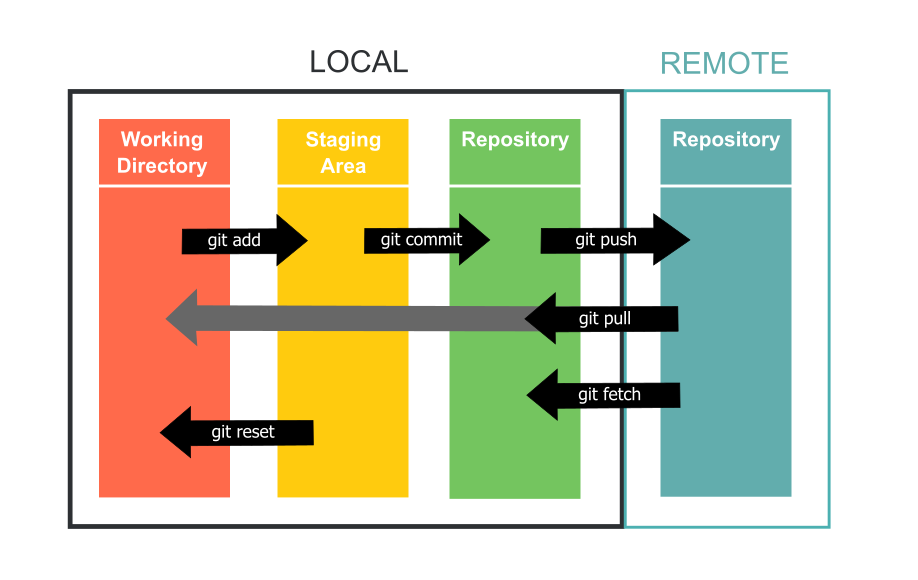

* REMOTE REPOSITORY (also called 'Upstream repository'):  
The online library hosted by Github which is available through the network.

* LOCAL REPOSITORY:  
This is the local copy of the remote repository which does not require network connection to work with. (Actually, only
connect to the remote repo when you explicitly request.)
    * **Working directory**:  
This is the set of files/folders that you see in your new cloned directory. These are your local ''working'' copies of
the files that are accessible. If you do any change in these files, you started to make changes in your working directory.  
        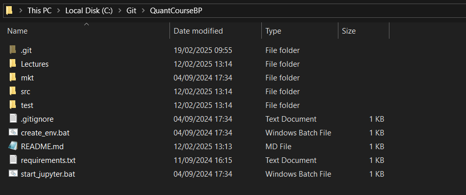

    * **Repository**:  
Let's say it is represented by the `.git` folder in your local folder (which can be hidden, but you can see if you allow
hidden file/folder view). It contains all the necessary information for the version controlling e.g. references, branches,
hook to the remote etc. (see details later). Whenever you checkout something or publish something, you interact first with
the local repository, and then it connects to the remote one.  
    :triangular_flag_on_post: DO NOT make changes manually in this `.git` folder, only communicate with Git via command line or GUI.

    * **Staging Area** (also called 'Index'):  
Whatever is ready to be published i.e. to be wrapped in a commit, can be put in a prepared state. The code changes that
you 'stage' would still be uncommitted, but won't be considered e.g. when you check the diffs in your working directory
(example can be found later). Anything you would like to wrap in the next commit, need to be staged first.

### File tracking

:exclamation: Important to note that **Git does not track folders, only files**. Adding an empty directory won't be a
change which Git recognizes.

Any files in your working directory can have two states: either `tracked` or `untracked`. If a files is 'tracked' it means
that Git knows about it and its history, so any change you made within this file would be detected by Git. On the other
hand, 'untracked' files are not yet known by Git, it does now follow changes in these files. To turn an untracked file
to a tracked one, you need to stage it.

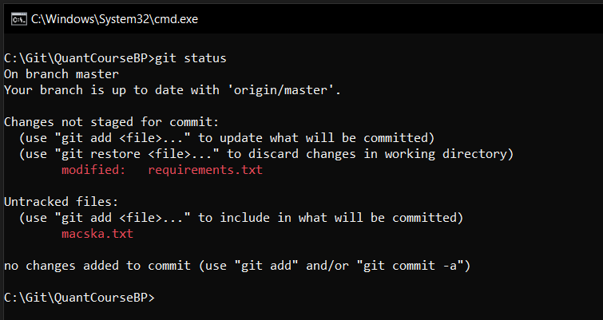

*For example, on the above screenshot, the changed tracked files are listed under the 'Changes not staged for commit',
while the untracked files (which must be staged to become tracked) are showed under 'Untracked files'.*

 

### The most important Git commands

Let's see what are the most frequently used commands of Git.

> :muscle: PRO TIP: you can pass `-h` to any commands to open the manual of the particular function

* `git clone <url-of-our-repo>`  
Clones the remote repository, creates the working directory from the 'master' branch and sets tracking for each branch
which exists in the remote.  
For more details, check our [How to setup Git?](https://github.com/QuantCourseBP/QuantCourseBP/wiki/How-to-setup-the-environment#how-to-setup-git) page.  
    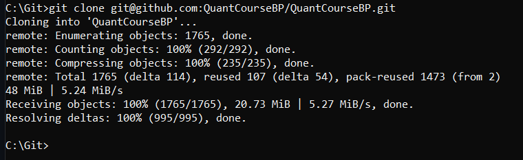

 

* `git checkout <branch-name>`  
Update the working directory completely to another branch.   
Options:
    * `git checkout -b <new-branch-name>`  
    Create a new branch, copying the history of the currently checked-out branch.  
    :exclamation: Try to figure out something unique for your branch name, to be able to find and identify it easier
    (like adding the date of creation or a ticket number to it e.g. *add_bsm_presenation_20250219* or *CEQA-1234_refactor_module_loading*)
    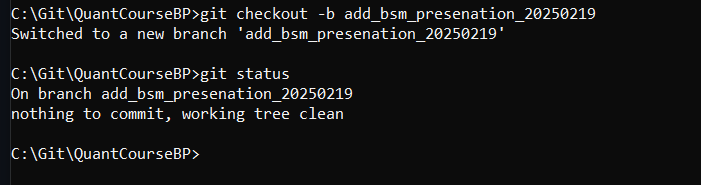  

> :white_check_mark: The top commit of the currently checked-out branch is usually referred as `HEAD`.
 

* `git log`  
Show the commit log on the HEAD branch. Useful when you need to identify a commit or need to see the different branch
states. For each commit, Git generates a unique, 40-character long hash called the `commit hash`.
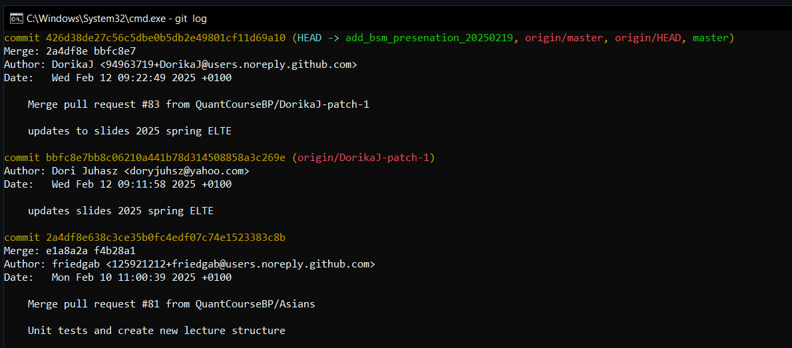  

 

* `git status`  
Display paths that have diffs either to the HEAD (committed code of the currenlty check-out branch) or the staging area.
Untracked files are also listed.  
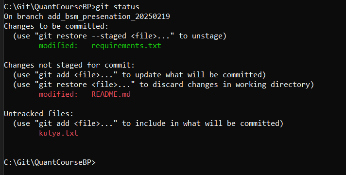  
*E.g. on the above screenshot, the files under 'Changes to be committed' are the staged files, the ones 'Changes not
staged for commit' are the unstaged diffs, and the untracked files are listed on the bottom.*

 

* `git add`  
In general, stages the specified files. It can be performed as many times you need before a commit.   
Options:
    * `git add -u`  
    Stages all the diffs in the tracked files.
    * `git add <paths-of-files>`  
    Stages all the specified files or all files in the specified folders, including untracked files. Paths need to be
    separated by spaces.  
    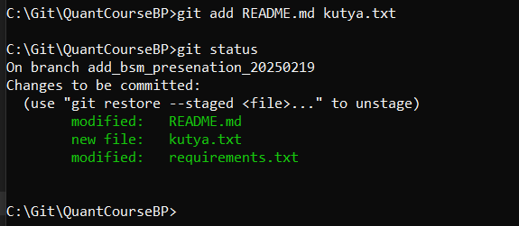  
    *E.g. on the above screenshot, the tracked 'requirements.txt' is staged which appears as a 'modified' file in the
    staging area, and the untracked 'kutya.txt' is staged as well which appears as a 'new file'.*

 

* `git reset`  
Unstage everything in the staging area.  
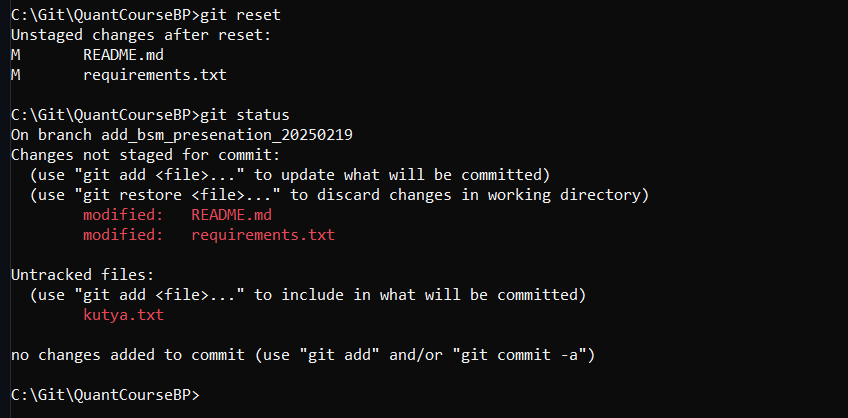  
Options:
    * `git reset <paths-of-files>`  
    Only unstage the selected files.

 

* `git diff`  
Show changes e.g. between the working directory and the staging area (this is the default, but there are many options).
Git always shows the new lines as green, and the removed lines as red.  
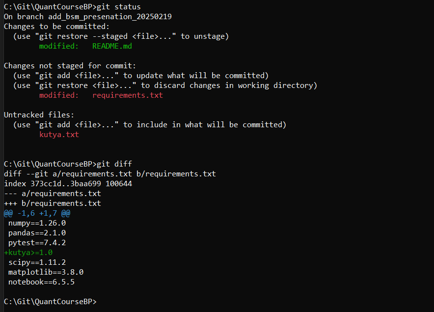  
*For example, on the above screenshot, we see the newly added line in the 'requirements.txt' file, but no change from
the 'README.md' file (since it is staged).*

 

* `git commit -m <commit-message>`  
Create a commit from the changes in the staging area with the given commit message.  
:exclamation: Please, always create a meaningful commit message (to ease to work of others and your future self).  
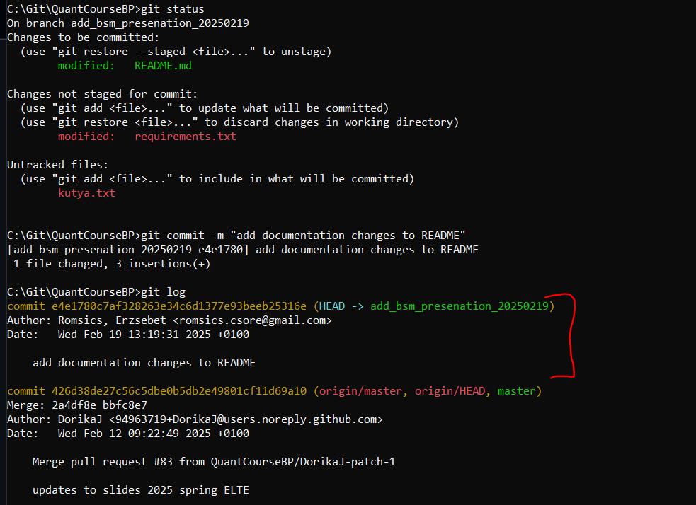  
*On the above screenshot, a new commit was created and put on the top of the currently checked-out branch.*

 

* `git branch`  
List branches which were already checked-out locally.  
    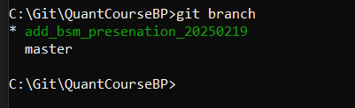

 

* `git pull`  
This is a composite command: first it fetches information from the remote repository (here we connect to the network),
and then **only on the currently checked-out branch**, merges the fetched commits to the local version of the branch.  
:star: This is the step where refresh the knowledge of your local Git repository with the latest happenings in the
remote and you can pick up the changes of others.

 

* `git push`  
Publish your commits to the remote repository. After this command, you can check your contribution via GitHub and it
* will be available for others to checkout.   
Options:
    * `git push -u origin <your-branch-name>`  
    You need to use this when you have a completely new branch locally, which was not yet pushed to the remote. `-u`
    translates to '--set-upstream', and with this command, you tell Git what branch needs to be created on the remote
    and to connect your local branch with it.  
    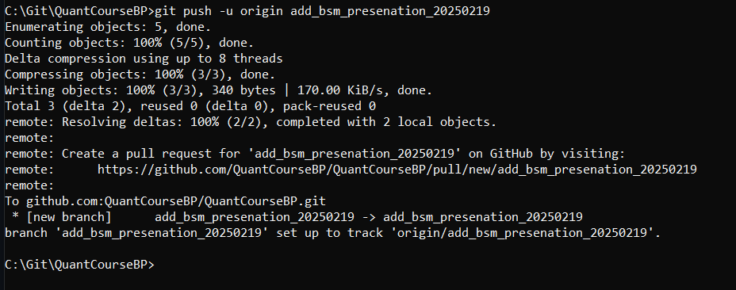  

 

## For advanced users

You can find the comprehensive Git documentation [here](https://git-scm.com/doc) where you can explore more features of Git.

TO BE ADDED
- what is a remote-tracking branch?
- what is a merge conflict and how to resolve?
